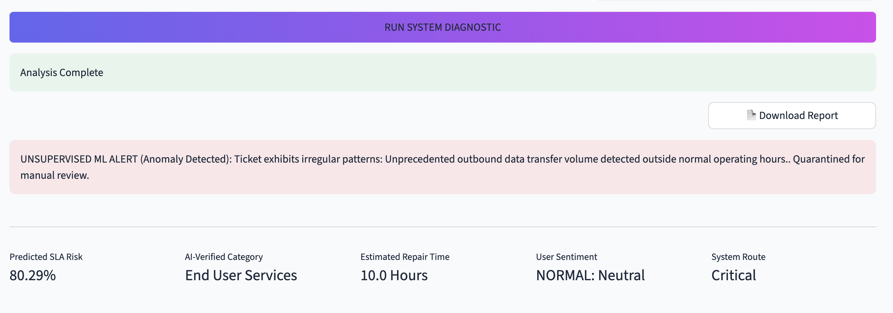
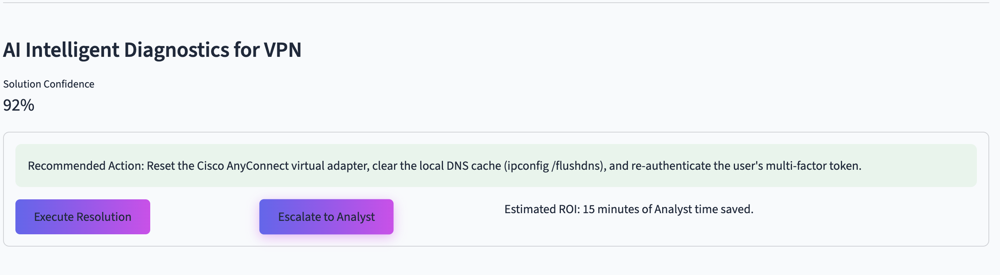
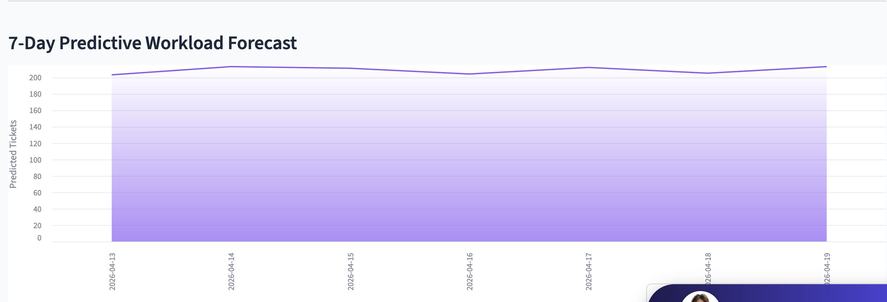
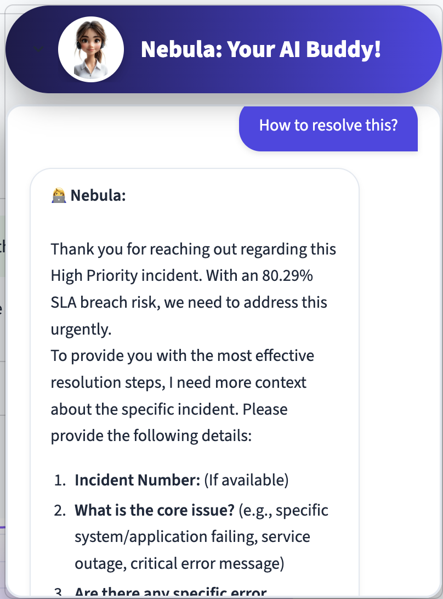
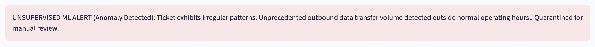
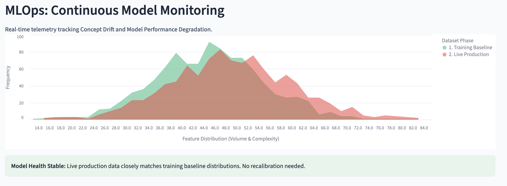
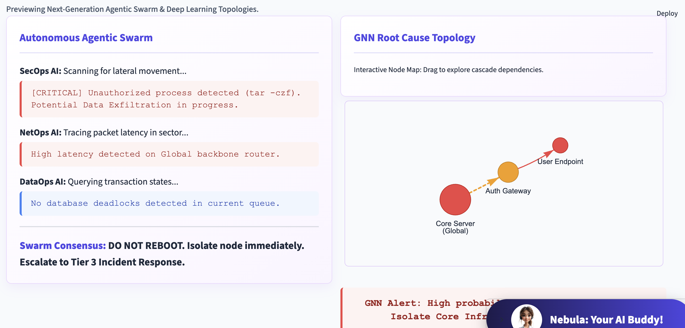

# AI-Powered ITSM Intelligence Platform

## Authors
- **Venkateswara Naik Mude**
- **Vamsi Krishna Bezawada**

## Academic Information
- Module : Data Analytics and Algorithms  
- Professor : **Dr. Greg Doyle** 


## Project Overview

The **AI-Powered ITSM Intelligence Platform** is a next-generation intelligent system designed to enhance traditional IT Service Management (ITSM) processes using advanced Artificial Intelligence techniques.

This platform integrates **Machine Learning, Natural Language Processing (NLP), and Predictive Analytics** to automate incident management, improve operational efficiency, and support proactive decision-making.

## Objectives

- Predict potential SLA breaches before they occur  
- Automate incident classification using NLP  
- Recommend intelligent resolutions based on historical data  
- Detect anomalies using unsupervised learning  
- Provide AI-assisted support through an interactive chatbot  
- Monitor model performance using MLOps principles  


## Machine Learning Models Used

### 1. SLA Breach Prediction (Classification Model)
- Algorithm: **XGBoost / Gradient Boosting**
- Input Features: Impact, Urgency, Priority, Region, etc.
- Output: Probability of SLA breach (%)

### 2. Root Cause Prediction
- Model: Supervised Classification Model
- Technique: Label Encoding + Feature Engineering
- Output: Predicted root cause category

### 3. NLP-Based Incident Classification
- Model: TF-IDF + Machine Learning Classifier
- Purpose: Categorize incident descriptions automatically

### 4. Similarity-Based Resolution Engine
- Technique: TF-IDF + Cosine Similarity
- Function: Finds similar past incidents and suggests resolutions

### 5. Anomaly Detection (Unsupervised Learning)
- Logic-based + statistical anomaly detection
- Detects:
  - Data inconsistencies
  - Suspicious patterns
  - Operational outliers

### 6. Time-to-Resolution Prediction (Regression Simulation)
- Predicts estimated resolution time (ETA)

## Data Processing
- Data cleaning and handling missing values
- One-hot encoding for categorical variables
- Feature alignment with trained model columns
- Text preprocessing for NLP tasks
- Removal of noisy/invalid values (NaN handling)

## System Architecture

User Input (Streamlit UI)  
↓  
FastAPI Backend  
↓  
Machine Learning Models (Prediction Layer)  
↓  
NLP & Similarity Engine  
↓  
Response Generation  
↓  
Streamlit Dashboard Visualization  

## Key Features

### Predictive SLA Risk Analysis
Predicts the likelihood of SLA breaches using trained machine learning models.

### AI-Based Incident Classification
Uses NLP techniques to categorize incident descriptions automatically.

### Intelligent Resolution Recommendation
Provides recommended solutions using similarity-based matching and ML models.

### Unsupervised Anomaly Detection
Identifies abnormal patterns such as unauthorized activities or unusual system behavior.

### AI Chatbot (Nebula)
An interactive AI assistant that provides real-time support and troubleshooting guidance.

### Workload Forecasting
Predicts future ticket volumes to assist in resource planning.

### MLOps Monitoring
Tracks model performance and detects concept drift between training and live data.

### Experimental AI Components
- Agentic AI Swarm simulation  
- Graph Neural Network (GNN) based root cause visualization

## Technologies Used

### Backend
- FastAPI
- Python

### Frontend
- Streamlit

### Machine Learning
- Scikit-learn
- XGBoost (or equivalent)
- TF-IDF Vectorization
- Cosine Similarity 

### Data Handling
- Pandas
- NumPy

### Visualization
- Altair

### AI Integration
- Google Generative AI (Gemini API)

## System Screenshots

### Dashboard Overview


### AI Intelligent Diagnostics


### Workload Forecast


### AI Chatbot (Nebula)


### Anomaly Detection


### MLOps Monitoring


### Agentic Swarm & GNN


## Dataset

The dataset used in this project was obtained from a **real-world IT enterprise system**.  
It contains historical incident records and has been utilized strictly for academic purposes.
- Source: Real-world IT company dataset (confidential)
- Format: CSV files
- Contains historical incident records, SLA details, and resolutions
	
## Disclaimer

This project is developed for academic purposes. The dataset used is anonymized and sourced from a real IT environment.

	
## Future Enhancements
	•	Real-time deployment on cloud (AWS/Azure)
	•	Integration with ITSM tools (ServiceNow, Jira)
	•	Advanced deep learning models
	•	Reinforcement learning for automated resolution systems

## How to Run the Project

### Step 1: Clone Repository
```bash
git clone <your-repo-link>
cd <repo-name>
```
### Step 2: Install Dependencies
For MAC:
python3 -m pip install -r requirements.txt

For Windows:
pip install -r requirements.txt

### Step 3: Run Backend (FastAPI)
For MAC:
python3 -m uvicorn main:app --reload

For Windows:
uvicorn main:app --reload

### Step 4: Run Frontend (Streamlit)
For MAC:
python3 -m streamlit run AI_Command_Center.py

For Windows:
streamlit run AI_Command_Center.py